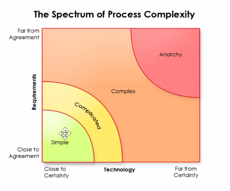

# Agile

## Tips

* Learn the business.
* Promote the flow of information.
    + Obsession of the flow of information.
    + Set up questions.
    + Know the market, get feedback, know the needs.
    + Look at changing market needs.
    + Products fail because they are too rigid to what they think the product should be.
* Principles of product ownership,
    + drives the ultimate value.
        - This is what the team is doing and this is what is needed from the customer.
    + Masters of inspect/adapt and promote change and communication.
    + Negotiate resources constantly to ensure the success of their products development.
    + PAUSE AND DIG

KEEP MOMENTUM GOING, see where there are pauses, which tickets are waiting for responses etc. and make those meeting s happen

## Above / Below the Line

### Above the line

1. Pro-activly asks questions to acquire information.
2. views conflicting information as an opportunity to grow general knowledge.
3. Promotes experimentation to try to solve problems.
4. Stays informed on all peripheral matters to their products.
5. Persists, keeps trying, never gives up, even when the team, the client, management, etc. don't understand.
6. Embrace complexity.

### Below the line

1. Reactively receives information only when provided by others.
2. Views conflicting information as threatening and confusing.
3. Avoides confrontation, shifts blame when team encounters failures.
4. Gives excuses for lack of understanding.
5. Sees adversity as a sign they are doing something wrong.
6. Lives in the simple.

Push aggresively with respect, display emotional intelligence.

## How Product Owners Drive Value

Live in the complicated, not complex and definitely not simple

A/B testing, is A or B better

## Backlog Management

Should be structured as a tree, working towards the EPICS
